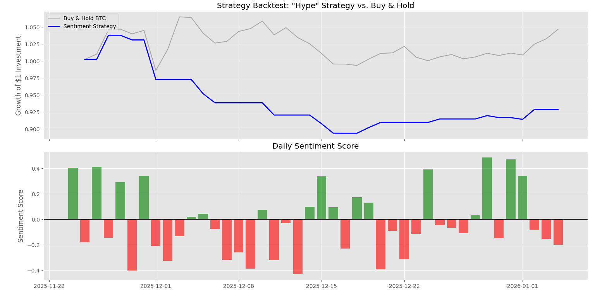

# 🚀 Hype vs. Reality: Algo-Trading Sentiment Engine


**A quantitative analysis pipeline that correlates Social Media Sentiment (Hype) with Bitcoin Price Action (Reality) to test algorithmic trading strategies.**

---

## 📊 The Results (Backtest)

*(The blue line represents the custom sentiment strategy vs. the gray "Buy & Hold" benchmark).*

---

## 💡 Project Overview
In algorithmic trading, "Alpha" often comes from alternative data. This project answers the question: **"Can we predict Bitcoin price movements based purely on news sentiment?"**

It builds a fully automated pipeline that:
1.  **Scrapes** unstructured news headlines daily.
2.  **Quantifies** sentiment using VADER (Valence Aware Dictionary for Social Media).
3.  **Fetches** historical OHLCV price data via `ccxt`.
4.  **Backtests** a "Long-Only" strategy against a benchmark.
5.  **Automates** the entire workflow using **GitHub Actions** (CI/CD).

## 🛠️ Tech Stack
* **Data Engineering:** `BeautifulSoup4`, `Requests` (Web Scraping), `ccxt` (Crypto Exchange APIs).
* **Natural Language Processing (NLP):** `VADER Sentiment` (Optimized for social media text/emojis).
* **Analysis & Visualization:** `Pandas`, `Matplotlib`, `NumPy`.
* **DevOps:** GitHub Actions (Cron jobs for daily automated data collection).

## 📂 Project Structure
```text
hype_vs_reality/
│
├── .github/workflows/   # CI/CD: Daily automation script
├── data/                # Database (CSVs)
│   ├── price_history/   # Historical BTC OHLCV data
│   └── raw_tweets/      # Scraped Sentiment scores
├── src/                 # Source Code
│   ├── data_loader.py   # Fetches price from Binance
│   ├── sentiment.py     # Scrapes & scores news
│   └── analysis.py      # Backtesting engine & plotting
└── requirements.txt     # Dependencies
```
## 🚀 How to Run Locally
1. Clone the Repo
Bash

git clone [https://github.com/YOUR_USERNAME/hype-vs-reality.git](https://github.com/YOUR_USERNAME/hype-vs-reality.git)
cd hype-vs-reality
2. Set up the Environment
Bash

# Create virtual environment
python -m venv venv

# Activate (Windows)
venv\Scripts\activate

# Activate (Mac/Linux)
source venv/bin/activate

# Install dependencies
pip install -r requirements.txt
3. Run the Pipeline
Bash

# Step 1: Get latest Price Data
python src/data_loader.py

# Step 2: Get latest Sentiment Data
python src/sentiment.py

# Step 3: Run the Analysis & Backtest
python src/analysis.py
## 📈 The Strategy Logic
The backtesting engine (src/analysis.py) tests the following hypothesis:

Signal: Calculate the VADER Compound Score (-1 to +1) for daily news.

Entry Condition: If Sentiment > 0 (Positive), open a LONG position for the next 24h.

Exit Condition: If Sentiment <= 0 (Negative/Neutral), close position and hold CASH.

Benchmark: Compare cumulative returns against a standard "Buy and Hold" strategy.

## 🤖 Automation
This project uses GitHub Actions to run a Cron job every day at 09:00 UTC.

It spins up an Ubuntu container.

Runs src/sentiment.py.

Commits the new data point to the data/ folder automatically.

This creates a self-sustaining dataset that grows over time without manual intervention.

Disclaimer: This project is for educational purposes only and does not constitute financial advice.